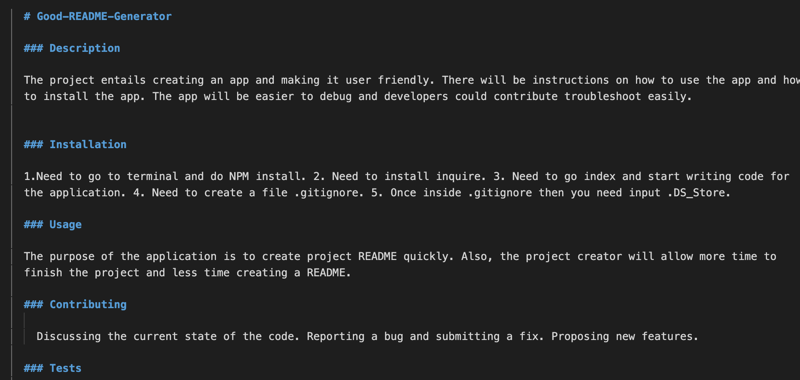

  # Good-README-Generator
  
  ### Description

  The project entails creating an app and making it user friendly. There will be instructions on how to use the app and how to install the app. The app will be easier to debug and developers could contribute troubleshoot easily.
  
  
  ### Installation
  
  1.Need to go to terminal and do NPM install. 2. Need to install inquire. 3. Need to go index and start writing code for the application. 4. Need to create a file .gitignore. 5. Once inside .gitignore then you need input .DS_Store.

  ### Usage

  The purpose of the application is to create project README quickly. Also, the project creator will allow more time to finish the project and less time creating a README.
  
  ### Contributing
  
    Discussing the current state of the code. Reporting a bug and submitting a fix. Proposing new features.

  ### Tests
  
  Going into the terminal and open the file. Once the file opens then you type in index.js and promptsto answer certain questions. Proceed answering the questions and then it will created README.md file. Here is the link for the demo ( https://github.com/kerishma/Good-README-Generator/blob/master/Develop/Untitled_%20Aug%206%2C%202020%205_57%20PM.gif )
  
  ## Author
  
  Github Repository - [kerishma](https://github.com/kerishma)

  Email - kerishma.tarin@gmail.com
  
  ## License
  
  This project is licensed under the mit license
  
